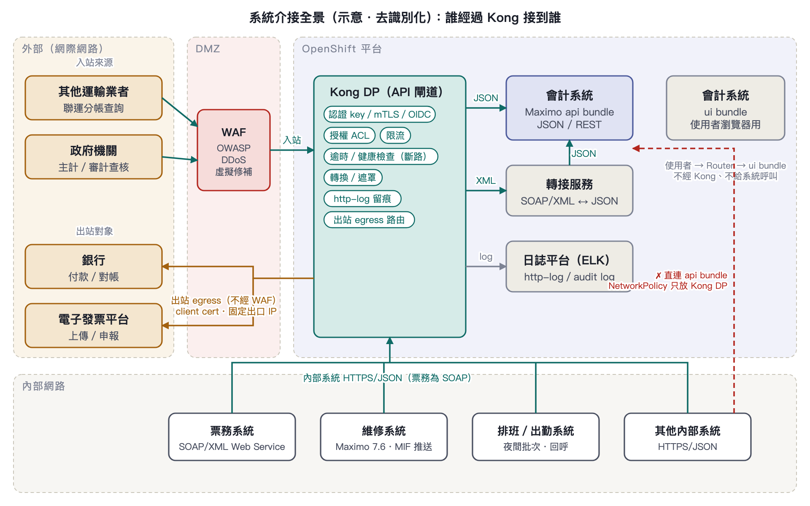
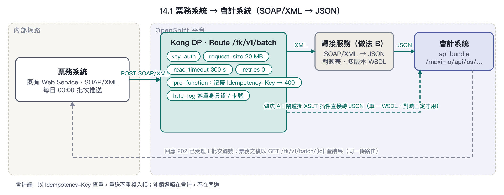
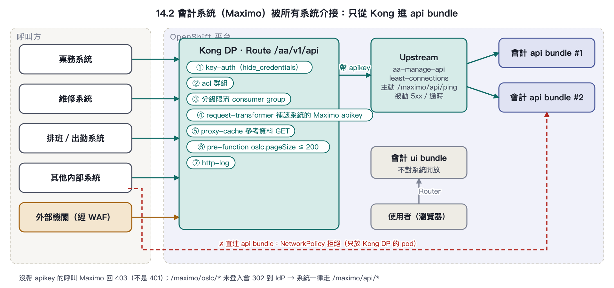
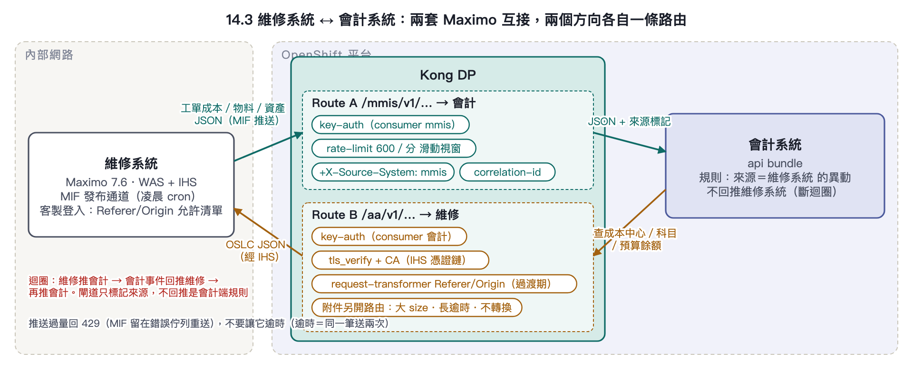
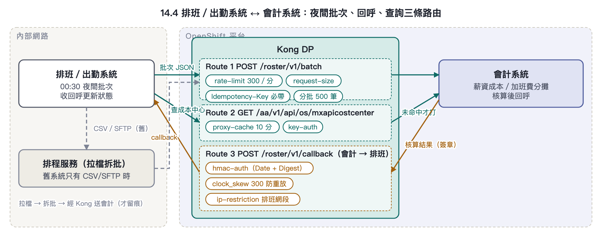
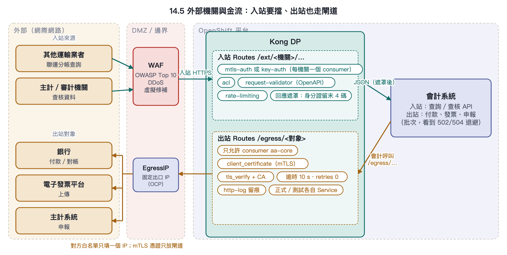

# 14 軌道業者系統介接情境：會遇到的問題與 Kong 的應對

本章以一個軌道業者的新會計系統為例，把前面各章的政策套到實際會碰到的介接上：外部協力廠商 → WAF → Kong → 會計系統；運務／工務／機務／電務／票務等內部系統 → Kong → 會計系統。系統與協定為示意（例如票務採既有 SOAP/XML Web Service），**實際介面以各專案的介面清單為準**。每個情境：情境與影響 → 會遇到的問題 → Kong 怎麼應對（每條標 `標準` 或 `客製`，定義同第 13 章）→ Kong 做不到、要誰做。最後一段是不分系統的共通做法。


先講結論：Kong 在這些介接裡負責的是**認證、限流、逾時與斷路、輕量轉換、留痕**五件事。資料對映、去重、業務規則、檔案格式與加簽，一律在後端或轉接服務做。把這條線畫清楚，後面每一題都好答。


## 14.0 介接矩陣

| 系統 | 方向與模式 | 協定 | 主要風險 | Kong 政策組合 | Enterprise？ | Kong 以外誰做 |
|---|---|---|---|---|---|---|
| **票務系統** | 票務 → 會計：每日營收／退票／沖銷批次；少量即時回查 | SOAP/XML（既有 Web Service） | XML↔JSON、重送重複入帳、大批次逾時、退票紀錄含身分證與卡號 | XSLT 轉換插件或轉接服務、獨立批次 Service（長逾時、大 size）、強制 Idempotency-Key、http-log 遮罩 | 轉換：否（社群／自訂）；request-validator：是 | 欄位對映表、去重、沖銷邏輯：會計後端／轉接服務；分頁改造：票務廠商 |
| **會計系統**（Maximo，被介接方） | 所有系統 → 會計 | HTTPS/JSON（OSLC/REST）、apikey 或 OIDC | 繞過閘道直連、日結／月結尖峰、API 流量打到 ui bundle、清單回應過大、403/302 誤判 | Upstream 指 api bundle、`/maximo/api/ping` 健康檢查、least-connections、分級限流、proxy-cache 參考資料、NetworkPolicy 只放 DP | 分級限流／遮罩：是 | 物件結構權限、apikey 輪替、日結凍結窗口：會計團隊；NetworkPolicy：平台團隊 |
| **維修系統**（工務／機務，Maximo 7.6 on WAS/IHS） | 雙向：工單成本／物料／資產 → 會計；成本中心／科目／預算餘額 → 維修系統 | OSLC JSON + MIF 推送；MAXAUTH 或 apikey | 兩套 Maximo 互推成迴圈、MIF 凌晨爆量、客製登入的 Referer/Origin 允許清單擋掉閘道、舊 TLS 憑證鏈、附件 | 雙向各自 Service/consumer、滑動視窗限流、request-transformer 補標頭、Service 憑證驗證、correlation-id 貫穿、附件走獨立路由 | 工作區隔離：是；其餘 OSS 可 | MIF 端點與錯誤佇列、允許清單、IHS 憑證：維修系統維護廠商；「來源＝維修系統不回推」規則：會計團隊 |
| **排班／出勤系統**（運務） | 夜間批次 → 會計；會計核算後回呼；下單前查成本中心 | HTTPS/JSON；舊系統可能只有檔案 | 固定時間爆量、回呼被偽造、重送與亂序、SFTP 檔案不經閘道 | consumer 限流視窗 + 分批、hmac-auth 驗回呼簽章、ip-restriction、proxy-cache 快取科目 | 否（OSS 夠用） | 檔案介接改由排程服務拉檔再打 API；排程錯開：雙方約定 |
| **外部機關與金流**（其他運輸業者、政府機關、銀行、電子發票） | 入站：聯運分帳查詢、主計／審計查核；出站：付款、電子發票上傳、申報 | HTTPS/JSON；部分 mTLS 或加簽 | 入站來源不可控、對方要求固定 IP 與憑證、出站沒留痕、測試打到對方正式、對方停機引發批次雪崩 | 入站：WAF 前置 + key/mtls-auth + acl + request-validator + 回應遮罩；出站：走閘道的 egress 路由、client_certificate、短逾時零重試、http-log | mtls-auth／request-validator：是 | 電子發票格式與加簽、銀行檔案格式：轉接服務；WAF 規則：WAF 廠商；固定出口 IP：OCP EgressIP |



_圖 14-0　系統介接全景：外部經 WAF → Kong 入站、內部系統直接進 Kong、會計系統出站也經 Kong 的 egress 路由；系統名稱為通稱。_

## 14.1 票務系統：SOAP/XML 既有 Web Service

**情境**：票務每日把營收、退票、沖銷資料送會計；會計偶爾回查單筆交易。票務只講 SOAP/XML，會計（Maximo）的 OSLC/REST 只收 JSON。

**影響**：轉換失敗＝當日營收進不了帳；重送＝重複認列要沖銷；批次逾時＝隔天人工補跑；個資進 log＝稽核缺失。



_圖 14-1　票務 → Kong → 轉接服務 → 會計；做法 A（閘道 XSLT）與做法 B（轉接服務）並列，回應以 202 非同步回執。_

### 會遇到的問題

- 協定不合：SOAP envelope、命名空間、WSDL 版本差異；Kong 核心與 Request Transformer Advanced 的 body 轉換**只處理 application/json，不解析 XML**。
- 重送＝重複入帳：批次中斷後票務整批重送，會計若沒去重就重複認列。
- 批次太大：一次上千筆，超過預設 request 大小與 60 秒 read_timeout。
- 個資：退票紀錄含身分證與卡號，會原樣進閘道 log。

### Kong 怎麼應對

- `標準` `客製` **轉換兩條路**。A：閘道掛 XSLT 型轉換插件（Kong CX 團隊的 `soap-rest-converter`，依 libxslt，XSLT 2.0 的 json-to-xml／xml-to-json），適合欄位對映固定、單一 WSDL 的介面。B：票務 → Kong → 轉接服務（XML→JSON 微服務）→ 會計，適合多版本 WSDL、要查表或多步驟。建議先 B 求穩，穩定的介面再收斂到 A。兩條路閘道都負責認證、限流、留痕。
- `標準` `客製` **強制冪等鍵**：批次路由掛 pre-function（OSS）或 request-validator `Enterprise`，沒帶 `Idempotency-Key` 直接 400；去重本體在會計端以鍵查重。注意 Kong 的 retries 對「已送出的 POST」不重送，閘道重試補救不了這題。
- `標準` **批次獨立 Service**：`read_timeout 300000`、request-size-limiting 20 MB；一般路由維持 60 秒／1 MB。請票務改分頁分批（每批 500 筆）並接受 202 非同步回執。
- `標準` **遮罩**：http-log 的 `custom_fields_by_lua` 把身分證、卡號欄位改寫為遮罩值；批次路由不掛 response-transformer（大回應會全部緩衝進記憶體）。

### Kong 做不到、要誰做

- XSLT 對映表、WSDL 版本差異、沖銷與去重邏輯：會計後端／轉接服務。
- 票務端改分頁、改回執流程：票務廠商。
- 企業版授權本身**不會**帶來 XML↔JSON body 轉換，回覆軌道業者時不要這樣寫。

```yaml
# 票務批次路由：獨立逾時與大小、沒帶冪等鍵就擋、log 遮罩
services:
- name: aa-ticketing-batch
  url: http://aa-adapter.aa.svc:8080/ticketing   # 轉接服務（做法 B）
  connect_timeout: 5000
  read_timeout: 300000
  write_timeout: 300000
  retries: 0
  routes:
  - name: ticketing-batch
    paths: ["/tk/v1/batch"]
    methods: ["POST"]
    plugins:
    - name: key-auth
      config: { key_in_query: false, hide_credentials: true }
    - name: request-size-limiting
      config: { allowed_payload_size: 20, size_unit: megabytes }
    - name: pre-function
      config:
        access:
        - |
          if not kong.request.get_header("Idempotency-Key") then
            return kong.response.exit(400, { message = "Idempotency-Key required" })
          end
    - name: http-log
      config:
        http_endpoint: https://logstash.example/kong
        custom_fields_by_lua:
          request.headers.authorization: "return nil"
          request.headers.apikey: "return nil"
          source_system: "return 'ticketing'"
```

## 14.2 會計系統：被所有人介接的 Maximo

**情境**：每個系統最後都打會計的 OSLC/REST（`/maximo/api/os/<物件結構>`）。它是整個架構的樞紐，也是雪崩時第一個倒的。

**影響**：繞道＝限流與稽核失效；尖峰＝日結延誤；ui／api 混用＝使用者操作卡頓；403 誤判＝呼叫方無限重試放大負載。



_圖 14-2　所有呼叫方只從 Kong 進會計 api bundle；Kong 依 consumer 補 Maximo apikey，NetworkPolicy 擋掉直連。_

### 會遇到的問題

- 繞道：內部系統拿到 Manage 網址就直連，限流與稽核形同虛設。
- 尖峰：日結／月結期間，批次推送與人工查詢擠同一組 JVM。
- bundle 混用：API 流量指到 ui bundle，跟使用者操作搶資源；`/maximo/oslc/*` 未登入會 302 到 IdP，機器呼叫看到 302 會誤判成功。
- 認證細節：Manage API 沒帶 apikey 回的是 **403 不是 401**；呼叫方的重試邏輯若只看 401 會一直重打。
- 大回應：`oslc.pageSize` 沒設，一次撈整張表。

### Kong 怎麼應對

- `標準` **只指 api bundle**：部署時獨立出 api bundle，Upstream 指它的 Service，不指 all／ui；主動健康檢查用 `/maximo/api/ping`（不需登入、回 200，實測），被動檢查 5xx 與逾時；演算法 least-connections。
- `標準` **路徑白名單**：對系統只開 `/maximo/api/…`，`/maximo/oslc/…` 與 `/maximo/ui` 不建 Route。
- `標準` **兩層憑證**：呼叫方用 Kong 的 key-auth（`hide_credentials` 剝掉），Kong 依 consumer 用 request-transformer 補上該系統專屬的 Maximo `apikey`（值放 Vault）。Maximo 的金鑰不離開閘道，輪替只改一處。
- `標準` **分級限流**：consumer group 綁 rate-limiting-advanced `Enterprise`，財務類系統高額度、查詢類低額度；日結窗口前 24 小時凍結閘道設定（CI 不 sync）。
- `標準` **參考資料快取**：科目、成本中心、幣別這類 GET 掛 proxy-cache（TTL 5–15 分鐘）。
- `客製` **強制分頁**：pre-function 檢查清單 GET 必帶 `oslc.pageSize` 且 ≤ 200，否則 400。
- `客製` **防繞道**：Manage 命名空間的 NetworkPolicy 只允許 Kong DP 的 pod 進 api bundle 埠，其他一律拒絕。這是唯一有效的方法，閘道自己擋不了繞道。

### Kong 做不到、要誰做

- 物件結構（OS）安全群組、整合使用者與 apikey 的產生與輪替、日結批次排程：會計團隊。
- NetworkPolicy 與 api bundle 拆分：OCP 平台團隊。
- 來源系統寫入資料欄位：會計端讀 Kong 加的 `X-Consumer-Username`，不要信任呼叫方自帶的標頭。

```yaml
# 會計 api bundle 為後端；每個 consumer 補自己的 Maximo apikey
upstreams:
- name: aa-manage-api
  algorithm: least-connections
  healthchecks:
    active:
      type: http
      http_path: /maximo/api/ping          # 不需登入、回 200；/maximo/oslc/* 未登入會 302
      healthy:   { interval: 10, successes: 2 }
      unhealthy: { interval: 10, http_failures: 3, timeouts: 3 }
    passive:
      unhealthy: { http_failures: 3, timeouts: 3, http_statuses: [500, 502, 503, 504] }
  targets:
  - target: mas-aa-api.mas-aa-manage.svc:9080
services:
- name: aa-manage-api
  host: aa-manage-api
  connect_timeout: 5000
  read_timeout: 60000
  retries: 1
  routes:
  - name: aa-api
    paths: ["/aa/v1/api"]
    strip_path: true
    plugins:
    - name: key-auth
      config: { key_in_query: false, hide_credentials: true }
    - name: acl
      config: { allow: ["aa-writers", "aa-readers"] }
consumers:
- username: mmis
  keyauth_credentials: [{ key: "{vault://hcv/kong/consumers/mmis/key}" }]
  plugins:
  - name: request-transformer                 # 綁 consumer：只對 mmis 生效
    config:
      add:
        headers: ["apikey:{vault://hcv/maximo/integration-users/mmis/apikey}"]
```

## 14.3 維修系統：兩套 Maximo 互打

**情境**：維修系統（工務／機務，Maximo 7.6 跑在 WebSphere + IHS）把工單完工成本、物料領用、資產異動送會計；會計把成本中心、科目、預算餘額給維修系統下單前檢核。

**影響**：迴圈＝資料重複與帳務錯亂；爆量＝凌晨後端當機；允許清單＝介接上線延期（要重建 jar）；舊 TLS＝閘道連不上後端。



_圖 14-3　維修 → 會計與會計 → 維修各自一條路由；Route A 加來源標記，Route B 處理舊平台憑證與允許清單的過渡。_

### 會遇到的問題

- 迴圈：維修系統的 MIF 發布通道推到會計，會計端事件又觸發回推維修系統，資料在兩套 Maximo 之間打轉或重複。
- 推送爆量：MIF 凌晨 cron 一次推幾千筆；端點逾時時整批留在錯誤佇列重送，同一筆送兩次。
- 客製登入擋掉閘道：維修系統的客製登入以 Referer／Origin 的 IP 允許清單放行，且**清單寫死在客製 jar**（實際案例）。流量改經閘道後來源與標頭都變了，會被擋，改清單要重建部署。
- 舊平台 TLS：IHS／WAS 的憑證鏈是內部 CA，或只談舊版 TLS，閘道對後端驗證失敗。
- 附件：工單附件（doclinks 在 NFS）要給會計看，一筆數十 MB。

### Kong 怎麼應對

- `標準` **方向分開**：維修系統→會計 與 會計→維修系統各自獨立 Service／Route／consumer，路徑前綴 `/mmis/…` 與 `/aa/…`；correlation-id 全域插件產生的 ID 兩邊都寫進 log，迴圈時一眼看出來源。
- `標準` `客製` **迴圈斷點**：request-transformer 對維修系統方向加 `X-Source-System: mmis`；會計端規則「來源＝維修系統的異動不回推」。閘道給標記，後端做判斷。
- `標準` **推送限流**：維修系統 consumer 掛滑動視窗限流（例如 600／分），超額回 429 而不是讓它逾時。MIF 收到明確的 4xx 會把訊息留在錯誤佇列等重送，不會同一筆送兩次；逾時才會。
- `標準` `客製` **標頭補正是過渡**：request-transformer 對維修系統方向的 Route 設 Host／Referer／Origin 為允許清單接受的值可先通；正解是請維修系統把 Kong DP 的出口 IP 加進允許清單並拿掉標頭檢查。這件事要在介接設計階段就提出，因為要重建 jar。
- `標準` **後端憑證**：Service 設 `tls_verify: true` 與 `ca_certificates` 指向 IHS 的鏈；對方只有 TLS 1.0／1.1 時 Kong 3.x 預設不談，要求 IHS 升到 1.2，不在閘道降級。
- `標準` **附件**：獨立路由、request-size-limiting 放大、read_timeout 拉長、不掛任何 body 轉換；或只傳附件連結由會計端拉取。

### Kong 做不到、要誰做

- MIF 端點與發布通道設定、錯誤佇列重送策略、允許清單改版、IHS 憑證與 TLS 版本：維修系統維護廠商。
- 「來源＝維修系統不回推」規則、附件拉取：會計團隊。
- 兩套 Maximo 的資料對映（工單成本科目、資產類別）：業務單位定義，閘道不參與。

```yaml
# 維修系統方向：來源標記 + 過渡期標頭補正 + 滑動視窗限流
plugins:
- name: correlation-id                      # 全域：每筆一個 ID，兩邊 log 都有
  config: { header_name: X-Correlation-Id, generator: uuid, echo_downstream: true }
- name: request-transformer
  route: mmis-inbound
  config:
    add:     { headers: ["X-Source-System:mmis"] }
    replace: { headers: ["Referer:https://mmis.example.internal/maximo/", "Origin:https://mmis.example.internal"] }  # 過渡期
- name: rate-limiting-advanced              # Enterprise；OSS 用 rate-limiting policy: redis
  consumer: mmis
  config: { limit: [600], window_size: [60], window_type: sliding, strategy: redis, sync_rate: 1,
            redis: { host: "{vault://env/REDIS_HOST}" } }
```

## 14.4 排班／出勤系統：固定時間的爆量與回呼

**情境**：每日 00:30 把出勤、加班、差勤結果送會計算薪資成本與加班費分攤；會計核算完回呼排班系統更新狀態；排班系統下單前查會計的成本中心。

**影響**：爆量＝薪資批次延誤；偽造回呼＝狀態被竄改；亂序＝舊狀態覆蓋新狀態；檔案介接＝完全不留痕。



_圖 14-4　排班的批次、成本中心查詢、會計回呼三條路由；舊系統的 CSV/SFTP 改由排程服務拉檔後經 Kong 送入。_

### 會遇到的問題

- 爆量：全公司資料同一分鐘湧入，跟票務 00:00 的批次撞在一起。
- 回呼真偽：會計→排班 的 webhook 沒簽章就能被偽造；反向亦然。
- 重送與亂序：網路抖動後客戶端重送，回呼順序錯亂，狀態被舊的蓋掉。
- 只有檔案：舊排班系統可能只能產 CSV 丟 SFTP，完全不經閘道。

### Kong 怎麼應對

- `標準` **限流 + 分批**：排班 consumer 限流視窗（例如 300／分）、request-size-limiting；要求分頁 500 筆／批。
- `標準` **回呼簽章**：hmac-auth（OSS）驗 `Date` 與 `Digest` 簽章，`clock_skew 300` 防重放，`validate_request_body` 確保 body 沒被改；再加 ip-restriction 只允許排班系統網段。
- `標準` **快取**：成本中心／科目查詢 proxy-cache 10 分鐘，擋掉下單前的重複查詢。
- `客製` **冪等與順序**：同 14.1 的 Idempotency-Key；順序由 payload 內的版本號或時間戳在後端比對，閘道不保證順序。

### Kong 做不到、要誰做

- SFTP／檔案介接不經閘道：改由 OCP 排程服務拉檔、拆批、再以 API 經 Kong 送會計，讓它也留痕。
- 排程錯開（票務 00:00、排班 00:30、維修系統 01:00）：雙方約定並寫進介接規格。
- 狀態覆蓋規則（以版本號為準）：會計與排班雙方後端。

```yaml
# 會計→排班 回呼：hmac 簽章 + 來源網段
routes:
- name: roster-callback
  paths: ["/roster/v1/callback"]
  methods: ["POST"]
  plugins:
  - name: hmac-auth
    config: { clock_skew: 300, validate_request_body: true, enforce_headers: ["date", "request-line", "digest"] }
  - name: ip-restriction
    config: { allow: ["10.20.30.0/24"] }
- name: aa-costcenters
  paths: ["/aa/v1/api/os/mxapicostcenter"]     # 參考資料：查詢快取
  methods: ["GET"]
  plugins:
  - name: proxy-cache
    config: { strategy: memory, cache_ttl: 600, content_type: ["application/json"], response_code: [200], request_method: ["GET"] }
```

## 14.5 外部機關與金流：入站要擋、出站也要走閘道

**情境**：入站有其他運輸業者的聯運分帳查詢、主計與審計機關的查核資料；出站有會計向銀行付款與對帳、向電子發票平台上傳、向主計系統申報。

**影響**：來源不可控＝資安事件；沒留痕＝對帳爭議沒有證據；環境混淆＝測試資料送進對方正式；對方停機＝整晚批次跑不完。



_圖 14-5　入站：外部機關 → WAF → Kong 入站路由 → 會計；出站：會計 → Kong egress 路由 → 固定出口 IP → 銀行／電子發票／主計系統。_

### 會遇到的問題

- 入站來源不可控：掃描、暴力嘗試、畸形 payload。
- 對方要求固定來源 IP 與 mTLS 憑證；對方的憑證鏈是政府 CA。
- 出站沒留痕：後端直接呼叫外部，沒人知道打了什麼、多久、失敗多少。
- 環境混淆：測試環境的批次打到對方正式端點。
- 對方停機：付款或發票平台維護時，會計批次逐筆逾時，整晚跑不完。

### Kong 怎麼應對

- `標準` **入站**：WAF 先擋 OWASP；Kong 每機關一個 consumer，key-auth 或 mtls-auth `Enterprise`（對方憑證的 CA 匯入）、acl、request-validator `Enterprise` 依 OpenAPI 擋畸形 payload、rate-limiting、回應遮罩（response-transformer-advanced／jq 對身分證欄位保留末 4 碼）。
- `標準` **出站也走閘道**：會計 → Kong Route `/egress/einvoice` → Service 指向外部網址；Service 設 `client_certificate`（mTLS）、`tls_verify` 與 `ca_certificates`、逾時 10 秒、`retries: 0`；全部進 http-log。這樣「打了什麼、多久、失敗多少」有單一紀錄，憑證也只放閘道。
- `客製` **固定出口 IP**：OCP EgressIP 綁在 Kong DP 的命名空間，對方白名單只填這一個 IP。
- `標準` **環境隔離**：正式與測試各自一組 CP／DP，外部 Service 的網址在各環境目錄分開宣告，decK 不可能把測試設定 sync 到正式。
- `標準` `客製` **對方停機**：外部端點通常不建 Upstream 做主動探測（對方不歡迎），改用被動：http-log 的 `upstream_status` 連續 5xx 觸發告警，並讓批次排程看到 502／504 就退避（例如 15 分鐘後再試），而不是逐筆等逾時。需要真正斷路時再建 Upstream 加被動健康檢查並設 `host_header`。

### Kong 做不到、要誰做

- 電子發票的訊息格式與加簽、銀行檔案格式與加密：轉接服務或會計後端。
- 向對方申請憑證與白名單：會計團隊與客戶窗口。
- WAF 規則與虛擬修補：WAF 廠商。EgressIP：OCP 平台團隊。

```yaml
# 出站（egress）：會計 → Kong → 電子發票平台
services:
- name: egress-einvoice
  url: https://einvoice.example.gov.tw/api
  protocol: https
  tls_verify: true
  ca_certificates: ["<政府 CA 的 certificate id>"]
  client_certificate: { id: "<mTLS 用戶端憑證 id>" }
  connect_timeout: 3000
  read_timeout: 10000
  retries: 0
  routes:
  - name: egress-einvoice
    paths: ["/egress/einvoice"]
    strip_path: true
    plugins:
    - name: key-auth                       # 只有會計系統這個 consumer 能用這條出站路由
    - name: acl
      config: { allow: ["aa-core"] }
    - name: http-log
      config: { http_endpoint: https://logstash.example/kong }
```

## 14.6 共通做法

- **一個系統一個 consumer、一個路徑前綴**（`/tk`、`/aa`、`/mmis`、`/roster`、`/ext/<機關>`、`/egress/<對象>`）；企業版再加一個工作區一組 RBAC。案例 17 的路徑衝突就是這樣避免的。
- **correlation-id 全域掛載**，ID 要求會計端與各系統寫進自己的 log；日誌平台用它串起端到端一筆交易。
- **版本並存**：`/v1`、`/v2` 兩條 Route 並存，舊版下線前先用 request-termination 回 410 與公告訊息一週。
- **每環境一組 CP＋DP**、consumer 金鑰各環境不同、外部端點各環境分開宣告。
- **個資遮罩清單集中一份**（欄位名與遮罩規則），所有 http-log 實例的 `custom_fields_by_lua` 共用同一段 Lua；改規則只改一處。
- **排程錯開表**與**批次大小上限**寫進每份介接規格，閘道限流值依此設定，不是反過來。
- **凍結窗口**：日結、月結、年結前 24 小時，閘道設定與後端版本一起凍結（CI 只 diff 不 sync）。


對客戶評估表或審查會議說明時的一致口徑：Kong 企業版帶來的是 Workspaces／RBAC、request-validator、進階限流與遮罩插件、Dev Portal 與原廠支援；**XML↔JSON body 轉換、斷路、遮罩都不是「買企業版就有」**——轉換靠 XSLT 插件或轉接服務，斷路是 Upstream 健康檢查（OSS 就有），遮罩靠回應轉換插件與 log 改寫。把這三句寫在回覆開頭，可以省掉後面一半的來回。

